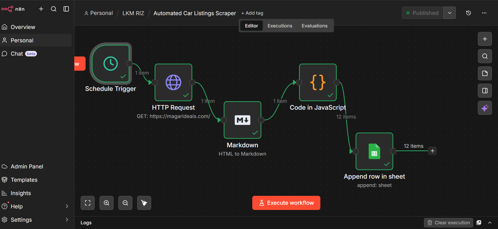

# Smart-Car-Listings-Automation

This workflow is a scheduled web scraping and data logging pipeline. It automatically extracts car listing details from a dealership website and stores them in a structured format for tracking and analysis.

It starts with a Schedule Trigger, which runs the workflow automatically every Monday at 9 AM. This ensures that the data collection happens consistently without any manual intervention.

Next, an HTTP Request node sends a GET request to the Magari Deals website, retrieving the raw HTML content of the car listings page.
Since raw HTML is difficult to process directly, the Markdown (HTML to Markdown) node converts the content into a cleaner and more structured format. This makes it easier to extract meaningful information.

The Code (JavaScript) node then parses the converted content and extracts relevant car details such as name, price, and other listing attributes. It also formats the data into structured items suitable for storage.

Finally, the processed data is sent to Google Sheets, where each car listing is appended as a new row. Over time, this builds a continuously updated dataset of car listings.

### Purpose of workflow
1. Automatically collect car listing data on a weekly basis.
2. Store data in a structured and accessible format.
3. Eliminate manual data entry and repetitive scraping tasks.

### Why This Is Powerful?
1. Ensures consistent and reliable data collection every week
2. Saves time by automating the entire scraping and logging process
3. Creates a growing dataset that can be used for analysis or decision-making